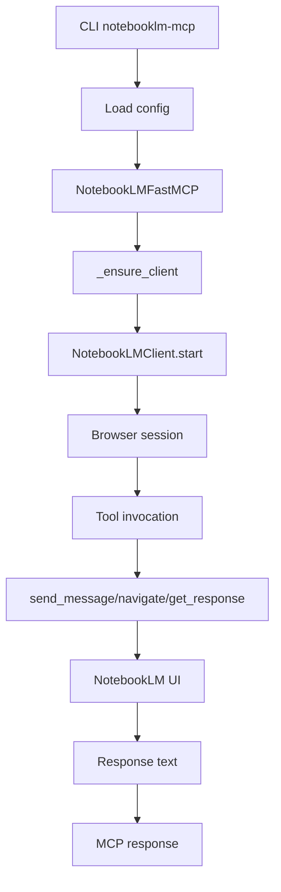
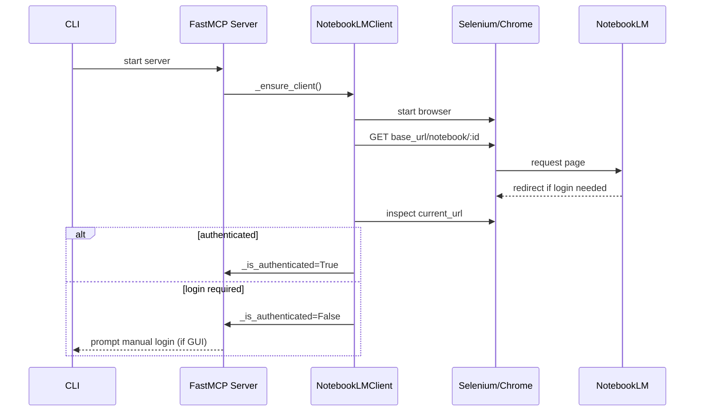
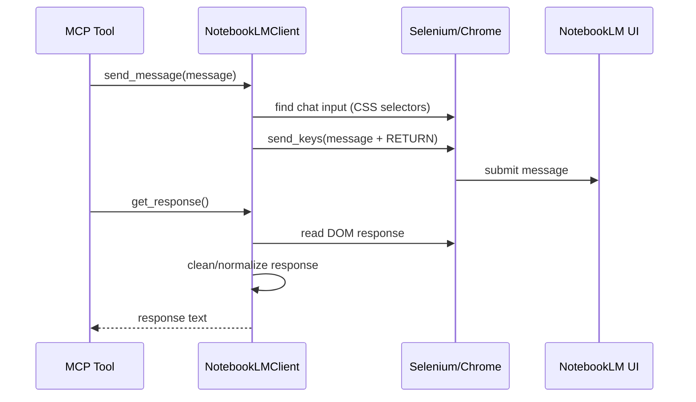

# Flujo MCP, autenticación y obtención de recursos

## Visión general del flujo MCP
El servidor se basa en FastMCP v2 y expone herramientas para interactuar con NotebookLM. El flujo general es:
1. La CLI carga configuración y crea el servidor FastMCP.
2. El servidor inicializa el cliente de Selenium y asegura autenticación.
3. Las herramientas MCP (chat, navegación) usan el cliente para interactuar con la UI de NotebookLM.
4. Se retornan respuestas al cliente MCP (STDIO/HTTP/SSE).

Referencias: creación del servidor y herramientas MCP en `server.py`, y cliente en `client.py`.【F:src/notebooklm_mcp/server.py†L32-L270】【F:src/notebooklm_mcp/client.py†L12-L476】

### Diagrama de flujo (alto nivel)

## Flujo de autenticación
El cliente abre la URL del notebook (o base URL) y determina si está autenticado en base a la URL actual. Si la URL no incluye `signin`/`accounts.google.com`, considera la sesión válida. La sesión puede persistirse mediante `profile_dir`, con lo cual el login puede no requerirse en ejecuciones futuras.

Referencias: autenticación en `client.py`, configuración del perfil en `config.py`, y flujo de setup en `cli.py`.【F:src/notebooklm_mcp/client.py†L112-L145】【F:src/notebooklm_mcp/config.py†L14-L182】【F:src/notebooklm_mcp/cli.py†L104-L198】

### Diagrama de secuencia (autenticación)

## Flujo de obtención de recursos (mensajes/respuestas)
Los “recursos” principales son el notebook y el chat dentro de NotebookLM. El flujo consiste en:
1. Asegurar que el notebook correcto esté cargado (por ID).
2. Localizar el input de chat con selectores CSS y enviar el mensaje.
3. Esperar respuesta (streaming) y extraer el texto del DOM.
4. Limpiar artefactos de UI y retornar el texto al cliente MCP.

Referencias: envío de mensaje y lectura de respuestas en `client.py`; herramientas MCP en `server.py`.【F:src/notebooklm_mcp/client.py†L147-L415】【F:src/notebooklm_mcp/server.py†L116-L212】

### Diagrama de secuencia (chat)

## Opciones de transporte MCP
El servidor puede ejecutarse en STDIO (default), HTTP o SSE. La CLI permite seleccionar el transporte y el host/puerto (para HTTP/SSE). La misma API MCP se mantiene entre transportes.

Referencias: opciones en `cli.py` y arranque en `server.py`.【F:src/notebooklm_mcp/cli.py†L205-L309】【F:src/notebooklm_mcp/server.py†L240-L270】

## Consideraciones de seguridad del flujo
- El flujo de autenticación depende del perfil persistente; proteger `profile_dir` es crítico para evitar robo de sesión. 【F:src/notebooklm_mcp/config.py†L14-L182】【F:src/notebooklm_mcp/client.py†L45-L72】
- El flujo HTTP/SSE no implementa autenticación ni autorización. Si se expone a la red, cualquier cliente podría enviar mensajes o acceder al notebook. 【F:src/notebooklm_mcp/server.py†L240-L270】
- El scraping de respuestas es heurístico; podría capturar contenido adicional si la UI cambia. 【F:src/notebooklm_mcp/client.py†L239-L337】
